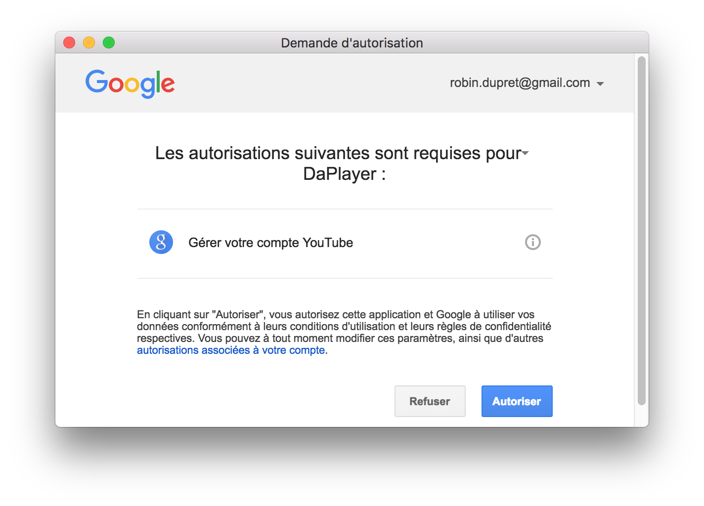

## Connecter votre compte

Connecter votre compte SoundCloud ou YouTube est très simple. Vous pouvez soit cliquer
sur n'importe quel lien dans la catégorie de votre choix dans la barre latérale ;
un panneau s'affiche alors vous proposant de connecter votre compte. Vous pouvez
également vous rendre sur la page de configuration en cliquant sur l'icône associée
( ) en haut à droite de la fenêtre.

Cliquez ensuite sur le bouton associé au service auquel vous souhaitez vous connecter.

> **Note** : Vous n'avez pas besoin de réaliser ces actions à chaque fois que
> vous souhaitez accéder à vos données SoundCloud ou YouTube. Vos comptes
> resteront connectés jusqu'à ce que vous les deconnectiez explicitement
> vous même (section suivante de ce document).

### Pour SoundCloud

Une fois que vous avez cliqué sur le bouton, une fenêtre apparaît vous permettant
d'entrer votre identifiant et votre mot de passe.

Une fois ceci fait, la fenêtre devrait se fermer automatiquement and si vous
aviez essayé d'accéder à un lien de la barre latérale, la page devrait se
rafraîchir automatiquement avec vos données.

### Pour YouTube

Une fois que vous avez cliqué sur le bouton, une fenêtre apparaît vous permettant
d'entrer votre identifiant et votre mot de passe.

Ensuite, une fenêtre va vous demander si vous souhaitez autoriser DaPlayer à
accéder à vos données :

Cliquez sur le bouton "Autoriser". La fenêtre devrait se fermer automatiquement
et si vous aviez essayé d'accéder à un lien de la barre latérale, la page devrait
se rafraîchir automatiquement avec vos données.

## Déconnecter votre compte

Si vous voulez utiliser un autre compte SoundCloud ou YouTube ou juste déconnecter
l'un des deux car vous ne vous en servez, vous pouvez vous rendre sur la page de
configuration (icône  en haut à
droite de la fenêtre).

Rendez vous ensuite à la section concernée et cliquer sur le bouton de déconnexion.

  
  {{ site.data.youtube.fr.youtube.disconnect }}

Cliquez simplement dessus et patientez jusqu'à ce que le bouton vous indique que
vous pouvez connecter un autre compte.
